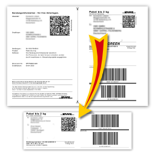

# DHL Label Converter 📦

This command line tool converts PDF labels from the DHL's offical website to a 62mm x 180mm PNG version that can be printed on smaller label printers such as the Brother QL-700.

## Usage

Create a `.jar` with maven

`mvn assembly:single`

Execute the `.jar` with

`java -jar [filename.jar] -path /../dhllabel.pdf (-type)`

## Options

The tool has two options:
`-p, -path` the path to the file you want to convert
`-t, -type` the type of the input file

The two supported types are `a` national label (for Germany) and `b` labels for international shipping. The default is `a`.
